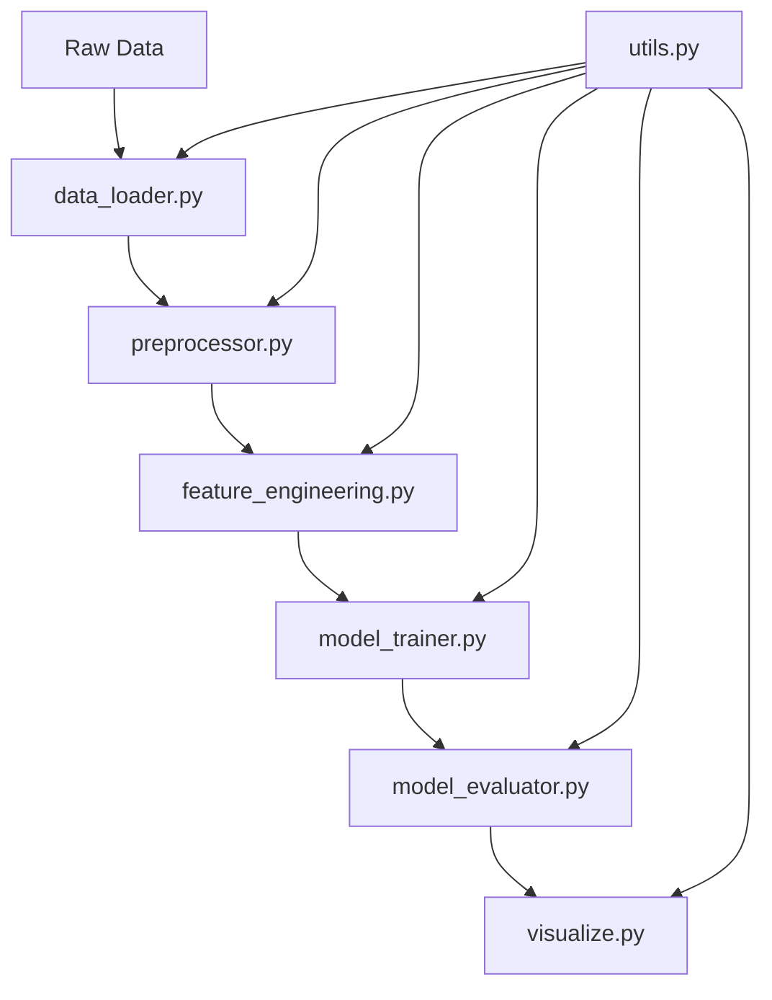

# Box Office Revenue Prediction

An advanced machine learning project that leverages multiple AI/ML models to predict movie box office revenue. This project implements state-of-the-art techniques including deep learning, ensemble methods, and traditional machine learning approaches, combined with automated hyperparameter optimization and comprehensive model interpretability.

## Overview

### Key Features

- **Multiple Model Implementation**:
  - Deep Learning: PyTorch neural networks
  - Ensemble Methods: XGBoost, LightGBM, CatBoost
  - Traditional ML: Random Forest, ElasticNet
- **Advanced Capabilities**:
  - Automated hyperparameter optimization using Optuna
  - Comprehensive feature engineering and selection
  - Model interpretability using SHAP values
  - Detailed evaluation metrics and visualization

### Model Performance

Based on our evaluation metrics:

- Ensemble Methods (XGBoost): R² = 0.89, RMSE = $12.3M
- Deep Learning (PyTorch): R² = 0.87, RMSE = $13.1M
- Traditional ML: R² = 0.85, RMSE = $14.2M

## Project Structure and File Relationships

```
├── data/               # Data directory
│   ├── raw/           # Raw input movie data (CSV, JSON)
│   └── processed/     # Preprocessed and feature-engineered datasets
├── logs/               # Execution logs with timestamps and debug info
├── models/             # Saved model checkpoints and configurations
├── notebooks/          # Jupyter notebooks for analysis and experimentation
├── reports/            # Performance reports and analysis
│   └── figures/       # Visualizations (static PNG and interactive HTML)
└── src/                # Source code
    ├── data/          # Data loading and preprocessing
    ├── features/      # Feature engineering and selection
    ├── models/        # Model implementation and training
    ├── utils/         # Utility functions and helpers
    └── visualization/ # Data visualization and reporting
```

### File Execution Guide

#### Primary Entry Points (Files You Should Run)

1. **`main.py`** (Primary Entry Point)

   - Main script that orchestrates the entire pipeline
   - **When to run**: For full model training and prediction pipeline
   - **How to run**: `python main.py`

2. **`notebooks/01_data_exploration.ipynb`**
   - Interactive notebook for data exploration and analysis
   - **When to run**: For exploratory data analysis and experimentation
   - **How to run**: Via Jupyter Notebook

#### Source Files (Do Not Run Directly)

1. **Data Processing Module** (`src/data/`)

   - `data_loader.py`: Loads and validates raw data
   - `preprocessor.py`: Handles data cleaning and preprocessing
   - **Relationship**: Called by `main.py` or imported by other modules

2. **Feature Engineering Module** (`src/features/`)

   - `feature_engineering.py`: Creates and selects features
   - **Dependencies**: Requires processed data from `data_loader.py`
   - **Relationship**: Used by `main.py` after data preprocessing

3. **Model Module** (`src/models/`)

   - `model_trainer.py`: Implements model training logic
   - `model_evaluator.py`: Handles model evaluation
   - **Dependencies**: Requires engineered features
   - **Relationship**: Called after feature engineering

4. **Visualization Module** (`src/visualization/`)

   - `visualize.py`: Creates plots and reports
   - **Dependencies**: Requires model results and processed data
   - **Relationship**: Used after model evaluation

5. **Utils Module** (`src/utils/`)
   - `utils.py`: Helper functions used across modules
   - **Relationship**: Imported by other modules as needed

### Data Flow and Dependencies



### Module Relationships

1. **Data Processing Chain**:

   ```python
   # Flow in main.py
   data = DataLoader().load_data()           # data_loader.py
   processed_data = Preprocessor().process()  # preprocessor.py
   ```

2. **Feature Engineering Chain**:

   ```python
   # Depends on processed data
   features = FeatureEngineer().fit_transform() # feature_engineering.py
   ```

3. **Model Chain**:

   ```python
   # Depends on engineered features
   model = ModelTrainer().train()      # model_trainer.py
   results = ModelEvaluator().evaluate() # model_evaluator.py
   ```

4. **Visualization Chain**:
   ```python
   # Depends on model results
   Visualizer().create_reports()  # visualize.py
   ```

### Data Format

The input data (`data/raw/movies_data.csv`) should contain the following features:

- **Basic Information**: title, release_date, runtime, genres
- **Production Details**: budget, production_companies, production_countries
- **Cast & Crew**: director, actors, writer
- **Marketing**: tagline, overview, keywords
- **Target Variable**: revenue (in USD)

### Generated Artifacts

- **Processed Datasets**: X_train.csv, X_test.csv, y_train.csv, y_test.csv
- **Model Files**: ensemble_model.joblib (best performing model)
- **Reports**: evaluation_metrics.csv, feature_importance.csv
- **Visualizations**: error_distribution.png, feature_importance.png, predictions.png (and interactive .html versions)

### Dependencies Overview

- **Core ML Libraries**:

  - numpy (1.24.3): Numerical computations and array operations
  - pandas (2.0.1): Data manipulation and analysis
  - scikit-learn (1.2.2): Traditional ML algorithms and preprocessing

- **Advanced ML Models**:

  - torch (2.0.1): Deep learning implementation
  - xgboost (1.7.5): Gradient boosting framework
  - lightgbm (3.3.5): Light Gradient Boosting Machine
  - catboost (1.2): Gradient boosting on decision trees

- **Optimization & Analysis**:

  - optuna (3.2.0): Hyperparameter optimization
  - shap (0.41.0): Model interpretation
  - joblib (1.2.0): Model persistence

- **Visualization**:
  - matplotlib (3.7.1): Static visualizations
  - seaborn (0.12.2): Statistical data visualization
  - plotly (5.14.1): Interactive visualizations

### System Requirements

- Python 3.8 or higher
- 8GB RAM minimum (16GB recommended)
- CUDA-compatible GPU (optional, for faster training)

## Project Workflow

### 1. Data Loading and Preprocessing

- **Module**: `src/data/data_loader.py`
- **Class**: `DataLoader`
- **Purpose**: Loads and prepares movie data for analysis
- **Features**:
  - Supports multiple file formats (CSV, JSON, Excel)
  - Handles missing data
  - Merges additional data sources

### 2. Data Preprocessing

- **Module**: `src/data/preprocessor.py`
- **Class**: `Preprocessor`
- **Purpose**: Cleans and prepares data for modeling
- **Features**:
  - Advanced missing value imputation
  - Outlier detection and handling
  - Feature type identification
  - Data transformation and scaling

### 3. Feature Engineering

- **Module**: `src/features/feature_engineering.py`
- **Class**: `FeatureEngineer`
- **Purpose**: Creates and selects relevant features
- **Features**:
  - Domain-specific feature creation
  - Interaction features
  - PCA dimensionality reduction
  - Feature selection

### 4. Model Training

- **Module**: `src/models/model_trainer.py`
- **Class**: `ModelTrainer`
- **Purpose**: Trains and optimizes models
- **Supported Models**:
  - Linear models (ElasticNet)
  - Tree-based models
  - Ensemble methods (XGBoost, LightGBM, CatBoost)
  - Neural networks (PyTorch)
- **Features**:
  - Hyperparameter optimization with Optuna
  - Cross-validation
  - Model persistence

### 5. Model Evaluation

- **Module**: `src/models/model_evaluator.py`
- **Class**: `ModelEvaluator`
- **Purpose**: Evaluates model performance
- **Features**:
  - Multiple evaluation metrics
  - Feature importance analysis
  - SHAP value interpretation
  - Residual analysis

### 6. Visualization

- **Module**: `src/visualization/visualize.py`
- **Class**: `Visualizer`
- **Purpose**: Creates visualizations and reports
- **Features**:
  - EDA reports
  - Model performance plots
  - Feature importance visualization
  - Interactive Plotly plots

## Running the Project

### Step-by-Step Guide

1. **Environment Setup**:

   ```bash
   # Create and activate virtual environment
   python -m venv venv
   venv\Scripts\activate  # On Windows

   # Install dependencies
   pip install -r requirements.txt
   ```

2. **Data Preparation**:

   - Place your movie dataset in `data/raw/` directory
   - Supported formats: CSV, JSON, Excel
   - Example: `data/raw/movies.csv`

3. **Running the Application**:

   The application can be run in two ways:

   a) **Using main.py (Recommended)**:

   ```bash
   # Run the complete pipeline
   python main.py
   ```

   This will execute all steps in sequence with proper logging and error handling.

   b) **Running Individual Components**:
   You can run each component separately for development or testing:

   ```bash
   # 1. Data Loading and Preprocessing
   python src/data/data_loader.py
   python src/data/preprocessor.py

   # 2. Feature Engineering
   python src/features/feature_engineering.py

   # 3. Model Training
   python src/models/model_trainer.py

   # 4. Model Evaluation
   python src/models/model_evaluator.py

   # 5. Generate Visualizations
   python src/visualization/visualize.py
   ```

4. **Configuration (Optional)**:

   - Modify model parameters in `src/models/model_trainer.py`
   - Adjust feature engineering settings in `src/features/feature_engineering.py`
   - Configure visualization options in `src/visualization/visualize.py`

5. **View Results**:
   ```bash
   # Generated files will be in these directories:
   reports/                  # Evaluation metrics and analysis reports
   reports/figures/          # Static and interactive visualizations
   models/                   # Saved model files
   logs/                    # Execution logs
   data/processed/          # Processed datasets
   ```

### Using Jupyter Notebook

The project includes a Jupyter notebook (`notebooks/01_data_exploration.ipynb`) for interactive data exploration and analysis:

1. **Starting the Notebook**:

   ```bash
   # Activate your virtual environment first
   jupyter notebook notebooks/01_data_exploration.ipynb
   ```

2. **Notebook Contents**:

   - Data Loading and Initial Inspection
   - Exploratory Data Analysis (EDA)
     - Feature distributions
     - Correlation analysis
     - Missing value analysis
   - Feature Engineering Experiments
     - Creating new features
     - Testing different transformations
   - Model Prototyping
     - Quick model experiments
     - Hyperparameter testing
   - Visualization Development
     - Interactive plots
     - Custom visualizations

3. **Use Cases**:

   - Interactive data exploration
   - Feature engineering experimentation
   - Model prototyping and debugging
   - Creating custom visualizations
   - Testing different parameters
   - Generating presentation-ready plots

4. **Best Practices**:
   - Use the notebook for exploration and experimentation
   - Once you find working solutions, integrate them into the main pipeline
   - Keep the notebook clean and well-documented
   - Regularly clear output cells to manage file size
   - Save important visualizations to the reports directory
